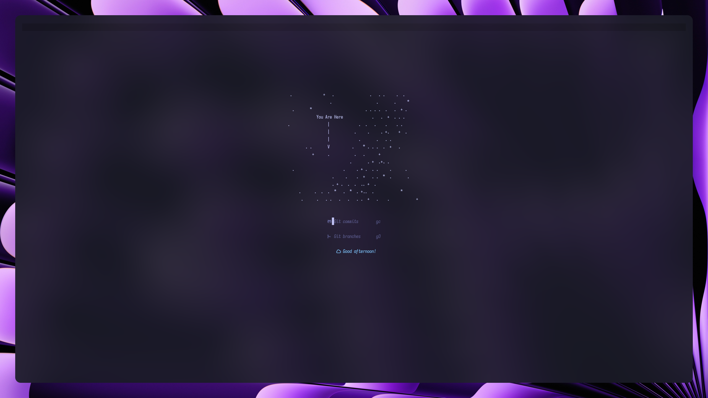

<div align="center">
<br><br>
<h1>✨ My NVIM setup✨</h1>
<h4>Here's my nvim setup with AI autocomplete, lsp, handy keyboard shortcuts and good performance</h4>
<br><br>

<br><br>


<br><br>
<a href="https://discord.gg/6xEc5WFK"></a>
<br><br>

<br><br>
<h1>Installing</h1>
<div align="left">

```
mv ~/.config/nvim ~/.config/nvim.backup
git clone https://github.com/Nighty3098/nvim ~/.config/nvim
```

</div>
<br><br><br>


### **`💵 Support me`**

<br>

***`UQCF-sPDO0QqkNtvy5CKSvYWEsZS6l7vzaytV36oYM0SNhKt`***

<br><br><br>


</div>
