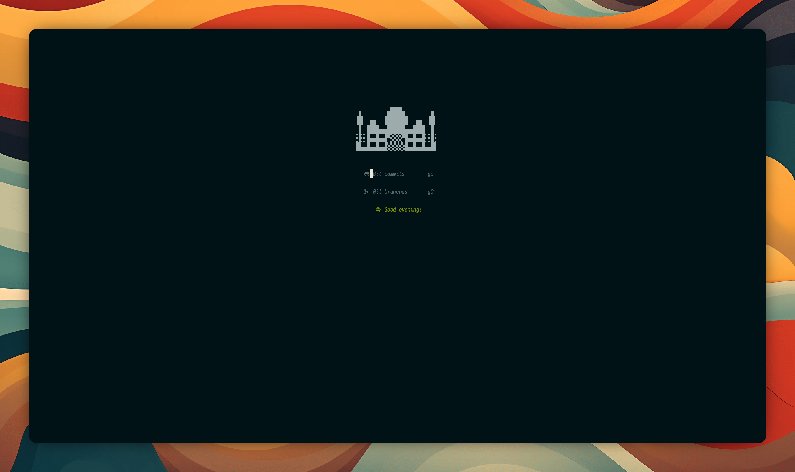
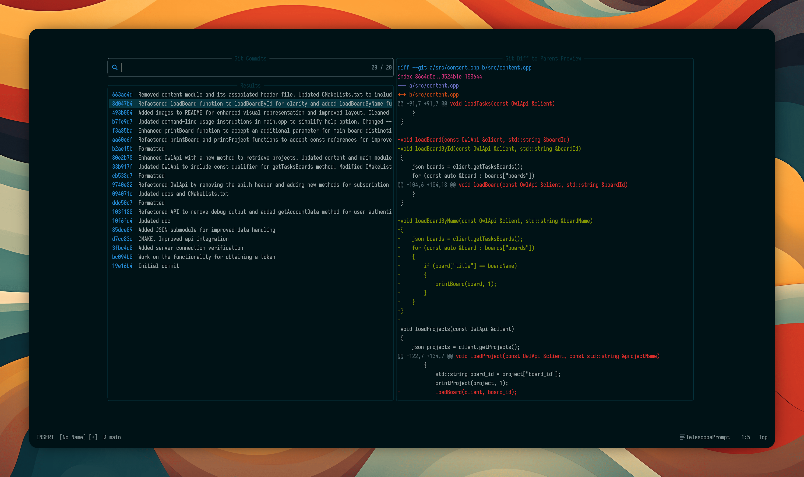

    <h1>My nvim currently setup</h1>
      
    
      
    
    
    
    
    
    
    
      
    
      
    
    <h3>Here's my nvim setup with AI autocomplete, lsp, handy keyboard shortcuts and good performance</h3>
    

    
<h2>Images</h2>

    
    
    
    
    

